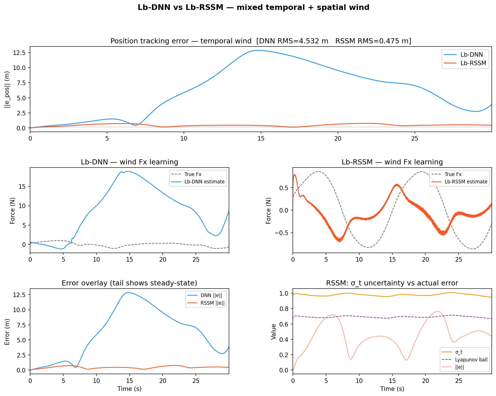

# Lb-RSSM

An extension of [Patil et al.'s Lyapunov-based DNN (Lb-DNN)](https://faculty.sites.ufl.edu/npatil/research/) controller that replaces the memoryless feature encoder with a Recurrent State-Space Model (RSSM). The key result: Lb-DNN diverges under time-varying disturbances that Lb-RSSM handles stably.

## The problem with Lb-DNN under temporal disturbances

The Lb-DNN stability proof (Patil et al.) guarantees UUB error provided the optimal weight matrix **W\*** stays approximately constant. This holds when the disturbance depends only on position — the same state always maps to the same wind force, so a memoryless encoder can learn it.

When the disturbance has a **temporal component** (e.g. `F(t, x) = sin(0.4t) + sin(0.8x)`), **W\*** must change at every timestep to track the wind phase. The Lyapunov update rule pushes **Ŵ** in conflicting directions and the error grows unboundedly.

The RSSM fixes this by feeding the GRU hidden state `h_t` as part of the feature vector `φ_t = [h_t, z_t]`. The hidden state encodes recent trajectory history, implicitly tracking temporal wind phase. With `h_t` included, the mapping from `φ_t` to wind force becomes approximately stationary again, restoring the Lyapunov condition.

## Results

Wind model: `Fx = 0.7·sin(0.4t) + 0.4·sin(0.8x)`, `Fy = 0.5·cos(0.3t) + 0.3·cos(0.9y)`, `Fz = 0.25·sin(0.5t)`

| Controller | RMS error (tail 5 s) | Max error |
|------------|----------------------|-----------|
| Lb-DNN     | 4.53 m               | 12.85 m   |
| Lb-RSSM    | **0.48 m**           | **0.76 m** |



## Getting started

```bash
pip install -r requirements.txt
```

Pretrained weights are included. To reproduce training from scratch:

```bash
python3 pretrain_quad_encoder.py   # ~2 min
python3 pretrain_quad_rssm.py      # ~3 min
```

Run the comparison:

```bash
python3 quad_compare.py
# → figures/quad_compare_temporal.png
```

## File structure

```
quad_dynamics.py            quadrotor physics + wind model
quad_compare.py             side-by-side DNN vs RSSM simulation

controllers/
  rssm_core.py              GRUCell + stochastic encoder (RSSMCore)
  lb_dnn_quad.py            memoryless Lb-DNN controller
  lb_rssm_quad.py           recurrent Lb-RSSM controller

pretrain_quad_encoder.py    offline pretraining for the DNN encoder
pretrain_quad_rssm.py       sequential episode pretraining for the RSSM
```

## Architecture

```
Lb-DNN:   φ(x) = MLP([pos, vel])               → stateless, can't track wind phase
Lb-RSSM:  h_t  = GRU(h_{t-1}, [pos, vel])
          z_t  ~ N(μ_t, σ_t)  from MLP(h_t)
          φ_t  = [h_t, z_t]                     → h_t encodes temporal context
```

`σ_t` gives a live uncertainty estimate. The theoretical Lyapunov error ball scales as `σ_t / √(K_d − 0.5)` — it widens when the drone enters an unfamiliar part of the wind field.
